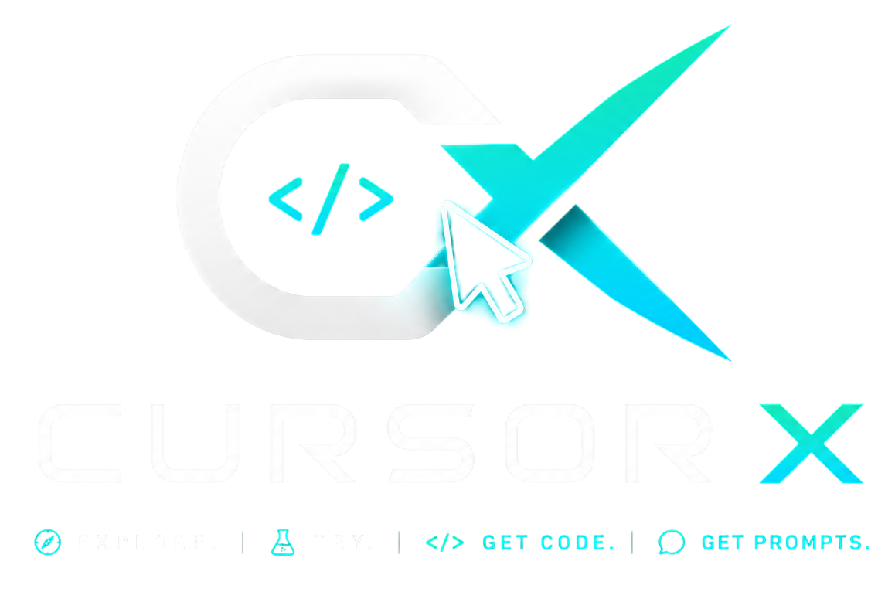
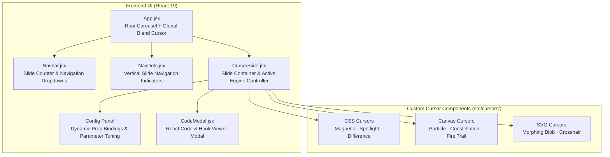

<p align="center">
  
</p>
<h1 align="center">CursorX: Interactive Cursor Effects</h1>
<p align="center">
  <strong>A premium gallery of high-performance interactive custom mouse cursors</strong><br/>
  <em>Navigate the carousel → cycle configurations → view and copy source code — all client-side</em>
</p>

<p align="center">
  
  
  
  
  
  
</p>

---

## Table of Contents

- [Overview](#overview)
- [Why CursorX](#why-cursorx)
- [Interactive Cursors Catalog](#interactive-cursors-catalog)
- [Architecture](#architecture)
- [General Processing Overview](#general-processing-overview)
- [UI and Interactive UX Guide](#ui-and-interactive-ux-guide)
- [Quick Start](#quick-start)
- [Performance Optimization and Failsafes](#performance-optimization-and-failsafes)
- [Project Structure and Key Components](#project-structure-and-key-components)
- [Dependencies](#dependencies)
- [Troubleshooting](#troubleshooting)
- [Author](#author)

---

## Overview

**CursorX** is an interactive, browser-based playground showcasing **24 custom cursor effects**. Built with React 19, Vite 8, and vanilla CSS, the application offers an aesthetic and immersive dark-themed experience. Each slide in the gallery features a distinct mouse interaction model, ranging from vector spring rings and fire ember simulations to physics-driven magnetic attraction and DOM gravity fields.

Users can interact with each cursor in an isolated demo area, dynamically customize parameters (e.g. speed, size, colors, stiffness, and gravity) in real-time, view the underlying React code, and copy the implementations directly to build premium micro-animations in their own web applications.

---

## Why CursorX

Most websites rely on standard browser pointers or basic CSS transitions. CursorX elevates the user experience by delivering highly responsive, fluid cursor designs with physical characteristics.

| Feature | Standard OS Cursor | Basic CSS Cursors | CursorX Cursors |
|---|---|---|---|
| **Interactivity** | Static OS arrow pointer, no movement feedback | Hover scaling, simple shape transitions | Symmetrical reflections, canvas trails, physics springs, liquid glass |
| **Customization** | System-restricted styles and sizes | Static style rules, hardcoded properties | Interactive live slider tuning for size, speed, color, and damping |
| **UX Feedback** | Default pointer changes on links (e.g., pointer hand) | Subtle color changes, standard transitions | Magnetic snapping, color blend inversion, dynamic ripple waves |
| **Performance** | Hardcoded system execution | GPU-bound basic CSS transitions | Optimized `requestAnimationFrame` loops with isolated render canvases |
| **Developer Utility** | None | Manual custom styling and writing | Real-time parameter preview + copy-paste ready React hooks |

---

## Interactive Cursors Catalog

CursorX contains 24 custom cursor effects, each with specific interactive features:

| # | Cursor Effect | Primary Technology | Interaction Description |
|---|---|---|---|
| 1 | **Magnetic** | CSS Transform & mousemove | Interactive elements are attracted to the cursor and snap back smoothly when the cursor leaves. |
| 2 | **Particle Trail** | Canvas API & gravity physics | Spawns glowing particles that drift downward and fade, forming a stardust trail behind the mouse. |
| 3 | **Spotlight** | CSS radial-gradient & vars | Darkens the viewport with a vignette, keeping a clean circle of light focused around the mouse position. |
| 4 | **Morphing Blob** | SVG gooey filter & lerp lag | A smooth, liquid blob follows the cursor and morphs dynamically using stdDeviation blur filters. |
| 5 | **Pixel Shatter** | Canvas API & velocity physics | Generates floating, rotating shards of glass/pixels that scatter based on mouse movement speed. |
| 6 | **Elastic Ring** | Spring-Physics & scale squash | A ring cursor that lags behind with spring mechanics, stretching and squashing as speed increases. |
| 7 | **Neon Glow** | CSS box-shadow & animation | A neon ring pulsing with electric light. Clicking anywhere cycles the glow through 5 preset colors. |
| 8 | **Text Orbiter** | Canvas API & trigonometry | A text string orbits the cursor in a circular path, rotating letters to face outward. |
| 9 | **Gravity Pull** | DOM Physics & spring return | Nearby DOM elements (such as preview buttons) are pulled toward the cursor, mimicking mass gravity. |
| 10 | **Constellation** | Canvas API & graph lines | Draws glowing connection lines between drifting background stars and the interactive cursor. |
| 11 | **Fire Trail** | Canvas API & HSL lifecycle | Streams rising flame embers that cool from bright yellow to red and slowly fade into grey smoke. |
| 12 | **Crosshair Scope** | Canvas API & SVG sweep | An animated tactical reticle with a rotating radar sweep that squeezes and locks on target when clicked. |
| 13 | **Mirror Ghost** | Canvas API & reflection axes | Symmetrically duplicates the cursor across four quadrants, creating a mirrored visual dance. |
| 14 | **Rainbow Comet** | Canvas API & HSL cycling | Tracks mouse position with a rainbow line that cycles through the color spectrum and glows. |
| 15 | **Bubble Float** | Canvas API & buoyancy physics | Releases floating transparent bubbles that rise slowly and wobble as they move up. |
| 16 | **Ripple Wave** | Canvas API & sine wave expansion | Emits concentric circular ripple waves on click, distorting the space under the cursor. |
| 17 | **Glitch Shift** | CSS transform offset | Splices the cursor into multiple color-offset frames that shift with erratic glitch pulses. |
| 18 | **Wind Stream** | Canvas API & wind simulation | Generates thin, smooth wind curves that trail behind the cursor and flutter with air current physics. |
| 19 | **DNA Helix** | Canvas API & double-helix math | Draws an elegant, rotating 3D double helix trail following the mouse. |
| 20 | **Torch Light** | CSS radial gradient & timer | A dimmer, flickering spotlight that mimics navigating a dark cave with a torch. |
| 21 | **Difference Blend** | CSS mix-blend-mode | A sleek vector circle that dynamically inverts colors of underlying elements (black becomes white, etc.). |
| 22 | **Ghost Trail** | Canvas API & trailing vector lag | Emits delayed vector trails that follow the cursor with smooth lerping. |
| 23 | **Audio Pulse** | Audio API / simulation physics | Emits pulsating soundwave lines centered around the cursor. |
| 24 | **Fluid Glass** | Canvas & scale zoom transforms | A magnifying lens cursor that magnifies the actual DOM components beneath it. |

---

## Architecture

CursorX operates as a single-page interactive application (SPA) built on React.



<details>
<summary>ASCII fallback (click to expand)</summary>

```
┌────────────────────────────────────────────────────────┐
│                       App.jsx                          │
│     (Root carousel context and global cursor)          │
│                                                        │
│  ┌────────────────┐    ┌────────────────────────────┐  │
│  │   Navbar.jsx   │    │      NavDots.jsx           │  │
│  │ (Slide counter │    │ (Vertical dots navigation) │  │
│  │ & dropdowns)   │    └────────────────────────────┘  │
│  └───────┬────────┘                                    │
│          │                                             │
│          ▼                                             │
│  ┌──────────────────────────────────────────────────┐  │
│  │                 CursorSlide.jsx                  │  │
│  │        (Active cursor engine controller)         │  │
│  │                                                  │  │
│  │  ┌──────────────┐  ┌──────────────┐  ┌────────┐  │  │
│  │  │ Config Panel │  │  Code Modal  │  │ Active │  │  │
│  │  │ (Parameter   │  │ (React code  │  │ Cursor │  │  │
│  │  │  tuning)     │  │  viewer)     │  │ Component││  │
│  │  └──────────────┘  └──────────────┘  └────┬───┘  │  │
│  └───────────────────────────────────────────┼──────┘  │
│                                              │         │
│                        ┌─────────────────────┴──────┐  │
│                        │     Render Output          │  │
│                        │                            │  │
│                        │  ┌──────────┐ ┌─────────┐  │  │
│                        │  │ Canvas   │ │ DOM /   │  │  │
│                        │  │ Drawing  │ │ SVG     │  │  │
│                        │  └──────────┘ └─────────┘  │  │
│                        └────────────────────────────┘  │
└────────────────────────────────────────────────────────┘
```

</details>

---

## General Processing Overview

1. **Carousel Navigation**: The user scrolls vertically, uses arrow keys, clicks the dots, or selects a cursor from the navbar menu to switch active slides.
2. **Mounting Cursors**: The application dynamically unmounts the previous cursor component and mounts the selected cursor component inside the slide's preview boundary.
3. **Prop Binding & Configuration**: Each cursor receives a reactive `config` object bound to sliders, color pickers, and toggles on the sidebar tuning panel. Changing a parameter instantly updates the cursor's rendering variables.
4. **Drawing Loops**: Canvas-based cursors start a `requestAnimationFrame` loop, drawing particles, splines, or shapes to the local canvas. CSS-based cursors update custom variables (e.g. `--x`, `--y`) on target divs.
5. **DOM Snapping and Gravity**: Cursors like **Magnetic** and **Gravity Pull** scan the isolated preview panel for elements with custom data attributes (`[data-magnetic]`, `[data-gravity]`), calculating distance matrices to pull/displace interactive elements.
6. **Code Export**: Clicking "View Code" opens the `CodeModal` displaying a formatted React hook or component that developers can copy and paste into their projects.

---

## UI and Interactive UX Guide

### Carousel Navigation & Navbar
* **Scroll Progress Indicator**: Located at the top of the screen, visualising the scroll depth.
* **Cursor Dropdown Menu**: Centered in the navbar, allowing users to jump directly to any of the 24 cursors.
* **Quick Links**: Located in the bottom-left corner of the Hero slide, helping users jump straight to the tutorial, custom code, or contact section.

### Parameter Tuning Panel
The configuration sidebar allows real-time rendering adjustments:

| Parameter Type | Interface Control | Visual Impact |
|---|---|---|
| **Colors** | Color swatch picker | Updates cursor dots, glows, particle hues, and connection lines. |
| **Sizes** | Horizontal range slider | Controls pointer diameter, ring radius, or max particle scale. |
| **Physics Rates** | Numeric range slider | Modifies Lerp follow speed, spring stiffness, damping coefficient, or gravity. |
| **Toggles** | Styled checkbox | Enables/disables pointer hover dilation or click-burst effects. |
| **Text Inputs** | String textbox | Sets the custom orbiting characters for the **Text Orbiter** cursor. |

### Code Modal & Code Highlight
Clicking the "View Code" button opens a centered, glassmorphic modal containing code blocks:
* **Copy Button**: A quick-trigger button in the upper right. On success, it displays a checkmark.
* **Failsafe Backdrop**: Clicking outside the modal container collapses it.

---

## Quick Start

### Prerequisites
- Node.js (v18 or higher)
- npm or yarn package manager

### Run from Source
Follow these steps to run the CursorX website locally:

```bash
# 1. Clone the repository
git clone https://github.com/Felix-au/CursorX.git
cd CursorX

# 2. Install dependencies
npm install

# 3. Start development server
npm run dev
```

Open [http://localhost:5173](http://localhost:5173) in your browser.

### Build and Preview Production Sandbox
To compile the production assets and test build correctness locally:

```bash
# 1. Build application assets
npm run build

# 2. Preview the built package locally
npm run preview
```

---

## Performance Optimization and Failsafes

Custom cursors can cause rendering latency if not managed correctly. CursorX implements optimization rules:

### Optimization Rules
* **Isolated Canvases**: Canvas-based cursors render inside a localized `.demo-canvas-area` preview div. Canvas sizes are restricted to the preview container bounds, rather than the full screen, to save GPU buffer memory.
* **Double Event Cleanup**: Every cursor hook and component executes strict unmount cleanups, calling `cancelAnimationFrame` and removing all global window mouse listeners.
* **Global Cursor Sleep**: The global site-wide difference blend cursor sets its opacity to `0` when the mouse enters any active cursor preview panel, avoiding double-cursor overlays.
* **Dilation Throttling**: Interactive components use CSS `will-change` properties on transition-heavy transform tags to trigger hardware layer promotion.

### Troubleshooting Failsafes

| Issue | Cause | Remedy / Failsafe |
|---|---|---|
| Cursor Lag / Stutter | Heavy GPU rendering or lack of browser acceleration. | Enable hardware acceleration in your browser. Reduce particle count in the config panel. |
| Multiple Cursors Visible | Unmount hooks did not clean up listeners. | Switch slides again. The React lifecycle will trigger unmount cleanup for orphaned canvas elements. |
| Magnifier lens offsets | Canvas viewport resize mismatch. | Resize the window. An active window resize listener automatically recalculates the boundary rect. |
| Code Copy Fails | Secure context issue. | Ensure you are accessing the page via `https` or `localhost` to allow Clipboard API access. |

---

## Project Structure and Key Components

```
CursorX/
├── api/
│   └── contact.js                # Serverless Next.js/Vercel contact handler (Resend integration)
├── public/
│   ├── favicon.svg               # Tab icon
│   ├── logo.png                  # Branded logo image
│   └── manifest.webmanifest      # Progressive Web App metadata
├── src/
│   ├── main.jsx                  # React entry point
│   ├── App.jsx                   # Layout, state management, and global difference cursor
│   ├── index.css                 # Premium dark-theme stylesheet
│   ├── data/
│   │   └── cursors.js            # Metadata, presets, prompts, and source code definitions
│   ├── components/
│   │   ├── Navbar.jsx            # Dynamic navigation bar
│   │   ├── NavDots.jsx           # Vertical indicator dots
│   │   ├── HeroSlide.jsx         # Splash landing slide
│   │   ├── CursorSlide.jsx       # Custom slide template for cursor interactions
│   │   ├── CodeModal.jsx         # Copyable React implementation modal
│   │   ├── TutorialSection.jsx   # Interactive usage walkthrough
│   │   ├── ContactSection.jsx    # Glassmorphic contact form
│   │   └── QuickLinksSection.jsx # Slide jump links
│   └── cursors/                  # The 24 modular cursor components
│       ├── MagneticCursor.jsx
│       ├── ParticleTrailCursor.jsx
│       ├── SpotlightCursor.jsx
│       └── ... (other cursor files)
├── package.json                  # Dependencies and run scripts
├── vite.config.js                # Vite build and layout paths configuration
└── README.md                     # Main documentation
```

### Key Components Role Summary

| File | Core Role |
|---|---|
| `App.jsx` | Orchestrates vertical slide scroll transitions, active cursor indices, and rendering of the global difference cursor. |
| `CursorSlide.jsx` | Hosts the interactive canvas sandbox and maps active sliders to individual cursor component configs. |
| `index.css` | Implements the dark-mode layout, glassmorphic styling cards, focus glows, and custom layout systems. |
| `api/contact.js` | Backend handler for the contact form, securely routing messages to the developer via Resend API. |
| `data/cursors.js` | Stores details for the 24 cursors, including name, tagline, description, parameters, and copy-paste code blocks. |

---

## Dependencies

CursorX keeps dependencies light to maximize loading speeds and performance:

| Dependency | Purpose |
|---|---|
| `react` | Component architecture and state management |
| `react-dom` | DOM rendering |
| `vite` | Ultra-fast local hot reload and production builds |
| `oxlint` | Lightweight linter checking syntax errors |

---

## Troubleshooting

### Cursors stuttering on external monitors
Make sure hardware acceleration is active in your browser's settings (`Settings -> System -> Use graphics acceleration when available`). Canvas rendering performance relies on GPU-driven rasterization.

### Contact form fails to send
The contact form uses a serverless backend API route at `/api/contact` powered by **Resend**. For local development, make sure a valid `RESEND_API_KEY` is present in a `.env.local` file. In production, this key must be set in the deployment dashboard environment variables.

### The magnifying glass has visual layout bugs
The **Fluid Glass** cursor captures a DOM clone of the preview area. Check that you are not using absolute or viewport styling offsets that collapse on copy. Standard CSS layout parameters work best with the clone routine.

---

## Author

**Felix Au**

* 🔗 GitHub: [github.com/Felix-au](https://github.com/Felix-au)
* 📧 Email: [felixogum@gmail.com](mailto:felixogum@gmail.com)

---

<p align="center">
  <sub>Interactive cursor aesthetics, crafted offline for web excellence.</sub>
</p>
